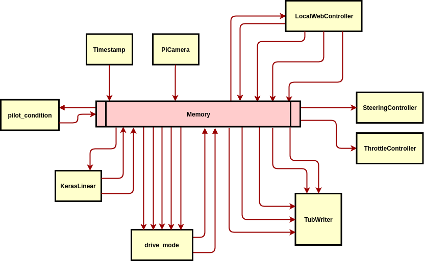
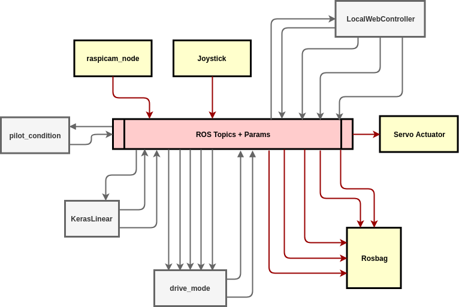

# ROS Donkey

> Exploring ROS on the Donkeycar Platform


## Table of Contents

- [Background](#background)
- [Dependencies](#dependencies)
- [Install](#install)
- [Usage](#usage)
- [Todo](#todo)
- [Maintainers](#maintainers)
- [Contributing](#contributing)
- [License](#license)

## Background

If you take a look at the [architecture](https://github.com/autorope/donkeycar/blob/dev/donkeycar/templates/donkey2.py) of the Donkey Car v2, you'll notice that it is organized as a set of modules. Each module is capable of accepting some input and giving some output, using the central `Memory` module as their source and sink. Also, there's a utility for recording a video stream along with synchronized throttle and steering commands so that a Deep Learning model can be trained. Here's a picture.



The arrows represent various inputs and outputs (the names of these omitted to keep the picture legible). This maps very closely to the way ROS projects are typically organized, in that inputs and outputs are handled by ROS topics and parameters, events are stored for playback in rosbags. Here's another picture, this time with the arrows standing in for ROS topics and parameters.



The bits in gray haven't yet been implemented yet.

## Dependencies

ROS, obviously. You may have heard of the pain of trying to build ROS on a Raspberry Pi. Ubiquity Robotics has your back there with their [Ubuntu Pi + ROS images](https://downloads.ubiquityrobotics.com/pi.html), batteries already included. Note that this setup has only been tested on ROS Kinetic and Melodic.

ROS Donkey also depends on Ubiquity Robotics' `raspicam_node` for camera input. If you use their image above, it may already be installed. However, just in case, instructions to install or build it can be found at this [Github repository](https://github.com/UbiquityRobotics/raspicam_node)

## Install

```
mkdir -p ~/donkey_ws/src
cd ~/donkey_ws/src
git clone git@github.com:liamondrop/ros-donkey.git
cd ~/donkey_ws
catkin_make
source devel/setup.bash
```

## Usage

### Vehicle Configuration

In the `ros_donkey` directory, there is a file called `config.yaml`. This contains the parameters for the steering and throttle servos, the raspicam, and mapping the joystick controls. You may need to change these for your particular setup.

### Joystick Setup

Currently, this project is only designed to work with a Linux compatible joystick, such as the Logitech F710. See [this page](http://wiki.ros.org/joy/Tutorials/ConfiguringALinuxJoystick) for more info.

### Raspicam Setup

The `raspicam_node` repository mentioned above in dependencies will help you get the camera up and running. Note that you can use `rqt_image_view` to view the video stream and `rqt_reconfigure` to help fine tune the camera settings (things like ISO, white balance, video stabilization, etc.).

### Servo Setup

The `donkey_actuator` node listens to two topics:

 - `/donkey/servo_pulse`: this topic accepts a `donkey_actuator/ServoPulse` message. The main purpose of this topic is to send pwm signals to help you fine tune the configuration of your servos. The following messages are an example of using this topic to find the pulse value corresponding to the steering servo's center, i.e. 333:
    ```
    rostopic pub /donkey/servo_pulse donkey_actuator/ServoPulse "{name: steering, value: 300}"
    rostopic pub /donkey/servo_pulse donkey_actuator/ServoPulse "{name: steering, value: 350}"
    rostopic pub /donkey/servo_pulse donkey_actuator/ServoPulse "{name: steering, value: 330}"
    rostopic pub /donkey/servo_pulse donkey_actuator/ServoPulse "{name: steering, value: 335}"
    rostopic pub /donkey/servo_pulse donkey_actuator/ServoPulse "{name: steering, value: 333}"
    ```
 - `/donkey/drive`: this topic is intended for control and accepts a standard `geometry_msgs/Twist` message, using the `linear.x` value for the throttle and the `angular.z` value for the steering. Note that these values should be between -1.0 and 1.0 inclusive. The following is an example of a command to drive straight forward at 75% throttle:
    ```
    rostopic pub /donkey/drive geometry_msgs/Twist "{linear: {x: 0.75}, angular: {z: 0.0}}"
    ```

### Launching the Vehicle

Issue the following command to start up the car:

```
roslaunch ros_donkey vehicle.launch
```

This will bring up the servo actuator, joystick controller, and raspicam nodes, allowing you to drive the vehicle manually.

### Recording Data

To record driving data, like camera frames and joystick commands to a rosbag, use the following command:

```
roslaunch ros_donkey vehicle.launch record:=true
```

This will save the images from the camera to the `/raspicam_node/image/compressed` topic and the joystick commands to the `/donkey/drive` topic as `TwistStamped` messages in a bagfile. The bag file will be automatically named according to the current timestamp and saved in the `~/.ros` directory.

### Training a Model

In order to train a model with your recorded rosbag data, give the path to the rosbag data you want to use as your input, as well as a path to the location for saving the model, with the following command:

```
roslaunch donkey_keras train.launch bag:=/my/data/dir/bag-file-name.bag model:=/my/model/dir/mymodel
```

To train an existing model, use the `base_model` argument, like so:

```
roslaunch donkey_keras train.launch ... base_model:=/my/model/dir/basemodel
```

**Note that you'll still need to provide the path to your rosbag data as well as a path to the place where you want to save your data. Also note that you'll need to use an absolute path for each of these arguments, or else relative to your home directory (`~`).**


## Todo

 - Manage drive mode (manual vs autonomous)
 - Start recording with a joystick command
 - Add deadman switch to autonomous mode for safety
 - Support loading training data from multiple ROS bags (currently only supports 1 at a time)
 - Local Web Controller for video streaming and control from a phone/computer
 - Build everything from scratch to make sure I didn't leave out some crucial steps in setup (probably did, sorry)

## Maintainers

[@liamondrop](https://github.com/liamondrop)

## Contributing

PRs accepted.

Small note: If editing the README, please conform to the [standard-readme](https://github.com/RichardLitt/standard-readme) specification.

## License

MIT © 2018 Liam Bowers
